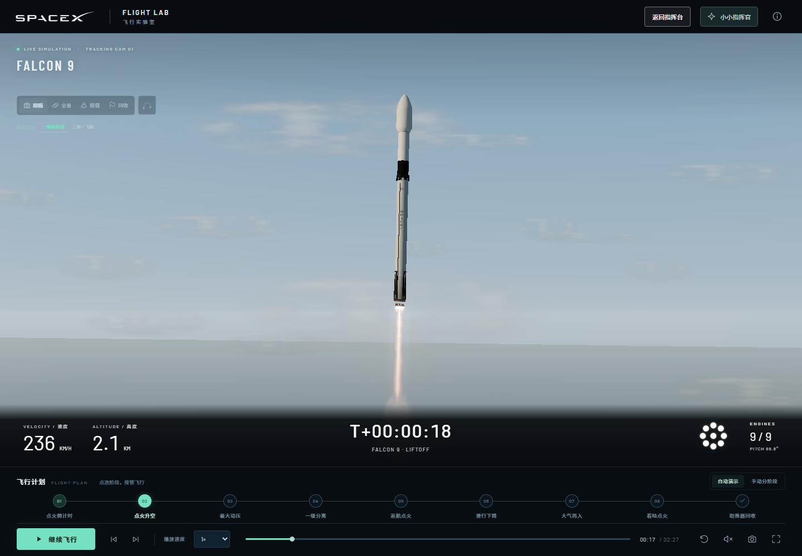

# SpaceX Flight Lab · Little Mission Commander

**中文版：[README.md](README.md)**

A 3D rocket launch and recovery simulator built for young space fans. Choose Falcon 9, Falcon Heavy, or Starship and watch the full mission — ignition, liftoff, staging, and landing — while browsing model dimensions, official reference material, and visual-quality notes.

All models and sound effects are generated procedurally and run locally. No account, no data collection, no ads, no paid features.



## Features

- **Three rockets**: Falcon 9, Falcon Heavy (27 first-stage engines across three cores), Starship (33-engine booster, hot-staging, tower catch).
- **Full mission timeline**: ignition, liftoff, max-Q, staging, fairing separation, boostback burn, re-entry burn, landing burn, and touchdown; jump directly to any stage on the timeline.
- **Manual staging mode**: pause at the end of every stage and wait for your command — handy for narrating step by step.
- **Multiple camera modes**: chase, wide, onboard, and recovery cameras; drag to orbit, scroll to zoom.
- **Broadcast view**: collapses the side panels and shows speed, altitude, engine status, and propellant for both stages at the bottom of the screen.
- **Spoken narration** (Chinese): countdown, stage commentary, and engine sound effects; audio is off by default.
- **Model inspection page**: rotate to inspect the windward side, belly, mechanisms, and engines; drag sliders to deploy landing legs or actuate Starship's flaps.
- **Dimensions reference**: lists official dimensions alongside the model's approximate scale, plus details for flaps, legs, grid fins, and nozzles.

### Keyboard shortcuts

| Key | Action |
| --- | --- |
| `Space` | Play / Pause |
| `←` `→` | Switch stage |
| `R` | Restart |
| `M` | Toggle audio |
| `F` | Fullscreen |
| `B` | Broadcast view |
| `K` | Kids mode |

### Full playback length (1×)

| Vehicle | Duration |
| --- | --- |
| Falcon 9 | 2 min 27 s |
| Falcon Heavy | 2 min 39 s |
| Starship | 3 min 21 s |

## Running locally

Requires Node.js and a modern browser (Edge or Chrome) with WebGL / hardware acceleration enabled.

```bash
npm install     # install dependencies
npm run dev     # dev server, http://127.0.0.1:4173
npm run build   # build to dist/
npm run preview # preview the production build
```

On Windows you can also double-click `Launch.vbs` (or run `Start-FlightLab.ps1`) to start the server and open the browser automatically. The script scans ports `4173`–`4183` for an available one and serves the app via `server.cjs`, which only binds to the local loopback address. A portable copy moved to another machine still needs Node.js installed first.

The build output in `dist/` can be deployed to any static file server — just upload its contents and keep the directory structure. `deploy/nginx.conf` is a sample Nginx configuration.

## Project structure

```
├── index.html              Main page entry point
├── model-review.html       Model inspection page entry point
├── src/                    Source code
│   ├── main.js             Main scene and interaction
│   ├── models.js           Procedural rocket models
│   ├── scene.js            Scene setup
│   ├── environment.js      Sky, ground, ocean, and atmosphere
│   ├── mission.js          Mission stages and timeline
│   ├── broadcast.js        Broadcast view
│   ├── dimensions.js       Vehicle dimension data
│   ├── model-review.js     Model inspection page logic
│   ├── references.js       Official reference comparison
│   ├── plume.js            Engine plumes
│   ├── thermal.js          Re-entry thermal effects
│   ├── audio.js            Sound effects and Chinese narration
│   ├── branding.js         Branding and livery
│   ├── rendering.js        Renderer setup
│   └── style.css           Styles
├── public/                 Static assets
│   ├── textures/           Earth textures
│   ├── reference/          Official SpaceX reference images
│   ├── quality/            Before/after visual-quality report
│   ├── model-audit/        Model audit screenshots
│   └── licenses/           Font and library licenses
├── deploy/nginx.conf       Sample deployment config
├── server.cjs              Local static file server
├── Start-FlightLab.ps1     Local launcher script
└── Launch.vbs              Double-click launch entry point
```

## Tech stack

- [Vite](https://vite.dev/) 7 — build tool and dev server, multi-page output (`index.html`, `model-review.html`)
- [three.js](https://threejs.org/) 0.180 — 3D rendering
- Vanilla JavaScript and CSS, no front-end framework
- [@fontsource/barlow](https://fontsource.org/) / barlow-condensed — bundled local fonts

## Documentation

The project notes below are written in Chinese only.

| Document | Content |
| --- | --- |
| [使用说明.md](使用说明.md) | How to play, shortcuts, differences between vehicles, and simulation scope |
| [外形尺寸一览.md](外形尺寸一览.md) | Official dimensions vs. the model's approximate scale, in detail |
| [官网参考与素材来源.md](官网参考与素材来源.md) | Official links, photo sources, and simplifications |
| [模型审核记录.md](模型审核记录.md) | Model detail review and change log |
| [画质评估与验收.md](画质评估与验收.md) | Visual-quality iteration notes (comparisons in `public/quality/index.html`) |
| [闪烁与连接修复记录.md](闪烁与连接修复记录.md) | v1.4 flicker fixes and structural completion notes |
| [服务器部署记录.md](服务器部署记录.md) | Deployment notes and update log |

## Scope and disclaimer

This is an educational demo built from publicly available dimensions and visible structural details. It is not affiliated with SpaceX and does not use official CAD models.

- Procedural models include engine nozzles, grid fins, landing legs, Starship flaps, and heat-shield tiles, but all sizing is approximated from photos.
- On-screen mission time and telemetry are representative teaching data; playback is compressed to a few minutes.
- Flight trajectories and attitude follow preset animation; wind, clouds, and ocean waves are mainly visual and do not involve real six-degrees-of-freedom aerodynamics, guidance, or propellant calculations.
- The high-altitude Earth backdrop is a separate layer with altitude-dependent curvature and does not represent an actual flight position or orbit.
- Reference configurations are Falcon 9 Block 5, Falcon Heavy, and the official 124 m Starship stack; this does not claim to reflect the latest V3 update.

SpaceX trademarks and official reference photos belong to their respective owners.
